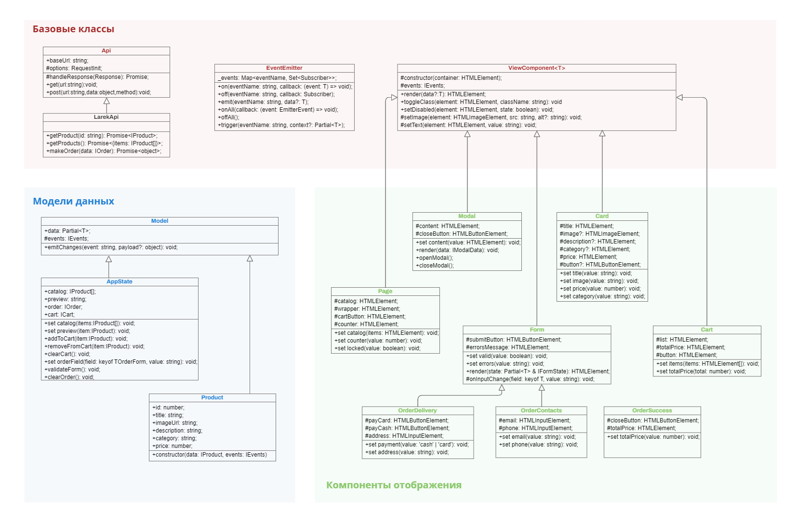

# Проект "Веб-ларек"

Создание MVP-архитектуры для интернет-магазина

Стек: HTML, SCSS, TS, Webpack

Структура проекта:
- src/ — исходные файлы проекта
- src/components/ — папка с JS компонентами
- src/components/base/ — папка с базовым кодом

Важные файлы:
- src/pages/index.html — HTML-файл главной страницы
- src/types/index.ts — файл с типами
- src/index.ts — точка входа приложения
- src/scss/styles.scss — корневой файл стилей
- src/utils/constants.ts — файл с константами
- src/utils/utils.ts — файл с утилитами

## Установка и запуск
Для установки и запуска проекта необходимо выполнить команды

```
npm install
npm run start
```

или

```
yarn
yarn start
```
## Сборка

```
npm run build
```

или

```
yarn build
```

## Архитектура
UML-схема:


В проекте используется паттерн MVP. Код состоит из 3-х частей:
1. **Модели данных**, отвечающей за хранение и изменения данных
2. **Отображения**, отвечающего за вывод данных
3. **Презентера**, реализующего взаимодействие модели и отображения

## Базовые классы
### Класс `Api`
Хранит основные поля и методы, необходимые при работе с сервером.

Поля:
* `baseUrl` — получение и хранение базового url сервера
* `options` — получение и хранение объекта с опциями запросов
  
Методы:
* `handleResponse` — обработка ответа сервера
* `get` — получение данных с сервера
* `post` — отправка данных на сервер

### Класс `EventEmitter`
Представляет собой брокер событий паттерна "Наблюдатель" и позволяет управлять событиями в веб-приложении, обеспечивая механизм для отправки и подписки на события. Данный класс предназначен для связи между слоем данных и визуальным представлением. 

Реализация класса стандартная.

Поля:
* `events`— коллекция, состоящая из событий и подписчиков

Методы:
* `on()` — подписка на событие
* `off()` — отписка от события
* `emit()` — инициализация события
* `onAll()` — подписка на все события
* `offAll()` — сброс всех обработчиков
* `trigger()` — возвращение функции, вызывающей инициализацию события, указанного в параметрах

### Класс `ViewComponent<T>`
Абстрактный класс, на основе которого создаются компоненты отображения.

Методы:
* `render` — рендер компонента, используя переданные данные
* `toggleClass` — переключение класса
* `setDisabled` — установка блокировки
* `setImage` — установка изображения и альтернативного текста
* `setText` — установка текста

## Модели данных
### Класс `Model<T>`
Абстрактный класс, содержащий конструктор, принимащий данные, и метод `emmitChanges` для регистрации события в `EventEmitter`.

### Класс `AppState`
Содержит в себе все данные веб-приложения.

Поля:
* `catalog` — содержит данные списка товаров с сервера
* `preview` — содержит данные товара, открытого в превью
* `order` — содержит данные заказа, которые отправляются на сервер
* `cart` — содержит данные товаров в корзине

Методы:
* `setCatalog` — установить данные в каталог
* `setPreview — установить данные в превью
* `addToCart — добавить товар в корзину
* `removeFromCart` — удалить товар из корзины
* `clearCart — очистка корзины
* `setOrderField — замена содержимого поля на полученное значение
* `validateForm — валидация формы заказа
* `clearOrder` — очистка данных заказа

### Класс `Product`
Содержит в себе данные каждого товара.

Поля:
* `id` — идентификатор
* `title` — название
* `imageUrl` — ссылка на изображение
* `description` — опсание
* `category` — категория
* `price` — цена
  
## Компоненты отображения
### Класс `Page`
Отоброжает главную страницу веб-приложения.

Поля:
* `catalog` — каталог товаров
* `wrapper` — обертка страницы
* `cartButton` — кнопка корзины
* `counter` — счетчик товаров

Сеттеры:
* `catalog` — изменяет товары в каталоге
* `counter` — изменяет значение счетчика
* `locked` — изменяет класс обертки на значение, соответствующее переданному

### Класс `Modal`
Отоброжает модальные окна в приложении.

Поля:
* `content` — содержимое модального окна
* `closeButton` — кнопка закрытия модального окна

Методы:
* `render` — рендер модального окна
* `openModal` — открытие модального окна
* `closeModal` — закрытие модального окна

Сеттеры:
* `content` — заменяет содержимое модального окна

### Класс `Card`
Отоброжает карточку товара.

Поля:
* `title` — заголовок карточки (название товара)
* `image` — элемент изображения товара
* `description` — элемент описания товара
* `category` — элемент категории товара
* `price` — элемент цены товара
* `button` — кнопка карточки

Сеттеры:
* `title` — меняет заголовок на название товара
* `image` — меняет изображение и альтернативный текст
* `price` — меняет элемент с ценой на цену товара
* `category` — меняет элемент категории на нужную
   
### Класс `Cart`
Отоброжает корзину.

Поля:
* `list` — список товаров в корзине
* `totalPrice` — сумма товаров в корзине
* `button` — кнопка оформления заказа

Сеттеры:
* `items` — изменение товаров в корзине
* `totalPrice` — изменение суммы товаров

### Класс `Form`
Отображает компонент формы. 

Поля:
* `submitButton` — кнопка сабмита формы
* `errorsMessage` — контейнер с сообщениями об ошибках
   
Сеттеры:
* `valid` — установка кнопки сабмита некликабельной
* `errors` — замена содержмого компонента с ошибками формы на переданное

Методы:
* `render` — рендер компонента формы
* `onInputChange` — отмечает событие изменения поля формы

### Класс `OrderDelivery`
Отображает модальное окно со способом оплаты и адресом доставки.

Поля:
* `payCard` — кнопка с вариантом оплаты картой
* `payCash` — кнопка с вариантом оплаты наличными
* `address` — поле для ввода адреса

Сеттеры:
* `payment` — замена класса кнопки в зависимости от выбранного типа оплаты
* `address` — замена адреса

### Класс `OrderContacts`
Отображает модальное окно с контактами пользователя.

Поля:
* `email` — поле для ввода email
* `phone` — поле для ввода номера телефона

Сеттеры:
* `email` — замена email
* `phone` — замена номера телефона

### Класс `OrderSuccess`
Отображает модальное окно с подтверждением успешности заказа.

Поля:
* `closeButton` — кнопка закрытия окна
* `totalPrice` — итоговая суммой заказа

Сеттеры:
* `totalPrice` — замена содержимого элемента с итоговой суммой заказа
